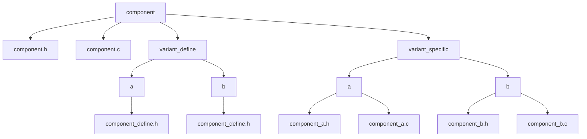
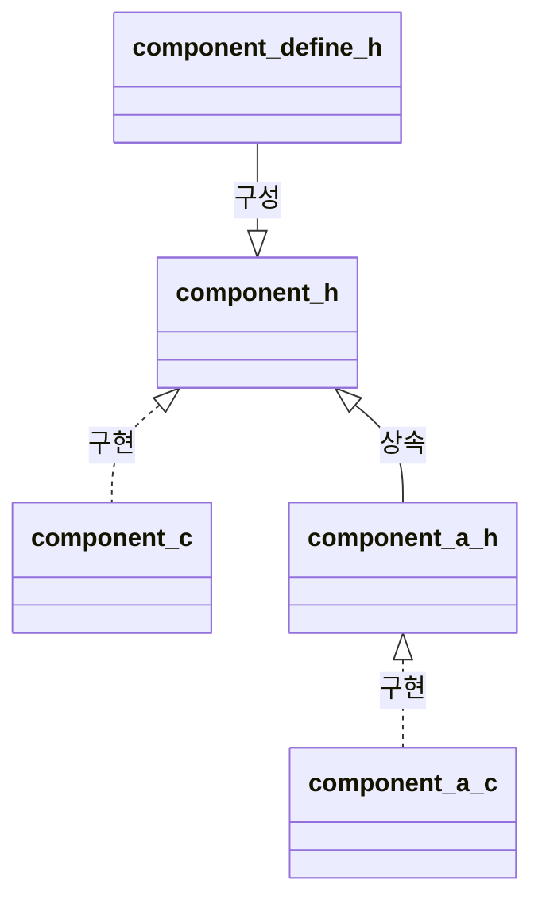

# C Compile-time Polymorphism

## 목적

*   빌드 시 Variant(구성) 선택을 통해, 동일 인터페이스를 갖는 컴포넌트의 구현을 다르게 결정 (정적 다형성).
*   런타임 오버헤드 없이 Variant 특화 코드 생성.

## 핵심 원리

*   동일 인터페이스 (component.h)에 대해, 빌드 시 선택된 Variant(a, b 등)의 특화 구현 (variant/...\_{variant}.c)을 링크하여 동작 변경.

## 디렉토리 및 파일 역할

* {component}/: 공통 요소 디렉토리.
    *   {component}.h: 공통 인터페이스 선언.
    *   {component}.c: (선택 사항) 모든 Variant 공통 로직 구현.
* variant_define/: Variant별 정의 루트 디렉토리.
    *   variant_define/{variant}/: 특정 Variant(a, b 등) 하위 디렉토리.
    *   {component}\_define.h: 해당 Variant의 매크로, 타입 등 정의. {component}.h가 포함.
*   variant_specific/: Variant별 특화 구현 루트 디렉토리.
    *   variant_specific/{variant}/: 특정 Variant(a, b 등) 하위 디렉토리.
    *   {component}\_{variant}.c: {component}.h 함수의 해당 Variant 특화 구현. 핵심 구현부.
    *   {component}\_{variant}.h: (선택 사항) 해당 Variant 전용 추가 인터페이스 선언.

## 핵심 의존성 규칙 (#include)
*   variant_define/{variant}/{component}\_define.h:
    *   {component}.h 헤더 포함 금지.
*   {component}.h:
    *   {component}\_define.h 포함 필수 (#include "{component}\_define.h"). 빌드 시스템이 경로 제공.
    *   variant_specific 디렉토리의 헤더 포함 금지.
*   {component}.c:
    *   {component}.h 포함 필수.
    *   define 또는 variant 디렉토리 파일 직접 포함 금지. \#ifdef 사용은 제한적 허용 (빌드 시스템 매크로 정의 시).
*   variant_specific/{variant}/{component}_{variant}.h:
    *   {component}.h 포함 필수.
*   variant_specific/{variant}/{component}_{variant}.c:
    *   {component}.h 또는 {component}_{variant}.h 포함.

## 빌드 시스템 필수 요구사항
*   Variant 식별 기능 제공.
*   {component}.c(존재 시) 및 활성 Variant의 variant/.../{component}_{variant}.c만 컴파일/링크 대상 포함.

## 네이밍 규칙
* 파일/함수: snake_case.
* define/variant 파일명: 제시된 패턴({component}_define.h, {component}_{variant}.c 등) 준수.
* Header Guard: _파일명_UPPER_CASE_H_
* \_파일명_UPPER_CASE_VARIANT_ == {variant}
