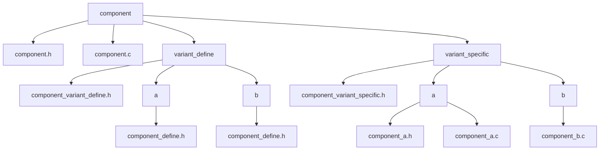
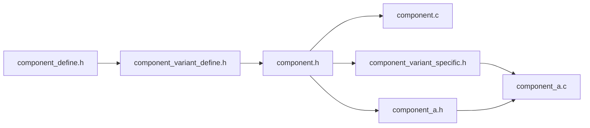

# compile time polymorphism

## purpose

- select variant at build time.
- same interface, different implementation.
- no runtime overhead.

## core principle

- {component}.h defines common interface.
- {component}_{variant}.c implements variant logic.
- build system links selected variant only.

## directory structure

- {component}/
  - {component}.h: common interface.
  - {component}.c: (optional) shared logic.
  - variant_define/
    - {component}_variant_define.h: variant selector.
    - {variant}/
      - {component}_define.h: variant specific macros and types.
  - variant_specific/
    - {component}_variant_specific.h: (optional) variant common internal interface.
    - {variant}/
      - {component}_{variant}.c: variant specific implementation.
      - {component}_{variant}.h: (optional) variant specific interface.

## include rules

1. {component}_define.h must not include {component}.h.
2. {component}_variant_define.h includes selected {component}_define.h.
3. {component}.h includes {component}_variant_define.h.
4. {component}.h must not include variant_specific headers.
5. {component}.c includes {component}.h.
6. {component}_variant_specific.h includes {component}.h.
7. {component}_{variant}.c includes {component}_variant_specific.h.
8. {component}_{variant}.h includes {component}.h.

## build system requirement

- define VARIANT_{COMPONENT} macro.
- compile only {component}.c and selected {component}_{variant}.c.
