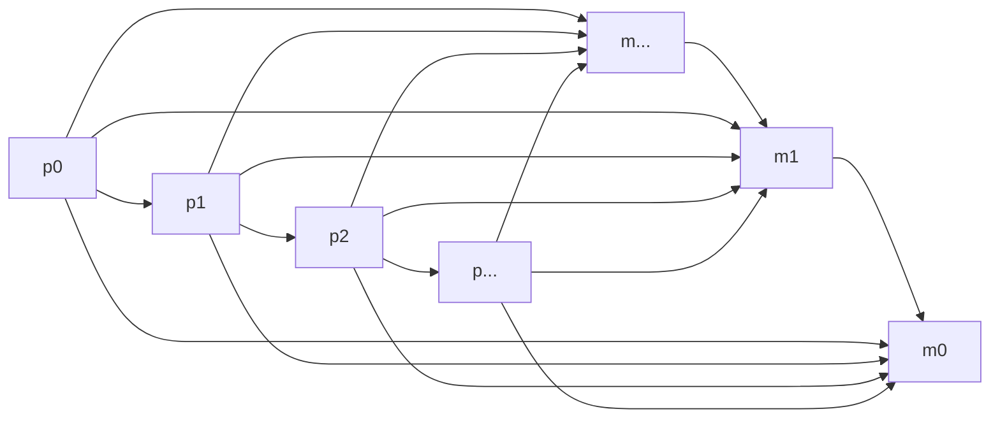
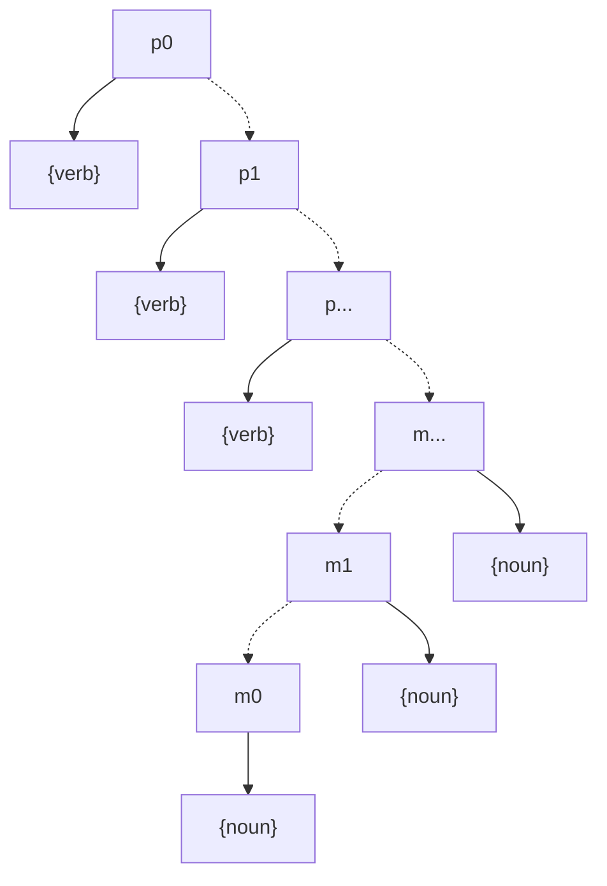

# procedure module layer

## purpose

- define dependency rules between procedure layer and module layer.

## effect

- prevent circular dependency.
- module count shows abstraction level.
- procedure count shows workflow complexity.
- module/procedure ratio shows design focus.

## layer

- procedure (p0, p1, p2, ...): top-down. p0 is top.
- module (m0, m1, m2, ...): bottom-up. m0 is bottom.

## component

- layer contains components.
- procedure component: verb. (init, loop, interrupt)
- module component: noun. (cpu, ram, rom)

## dependency rule

1. pX can include pY. (Y > X)
2. mX can include mY. (Y < X)
3. pX can include mY. (any Y)
4. mX cannot include pY. (any Y)



## directory structure

```
p0/
    {verb}/
p1/
    {verb}/
p.../
    {verb}/
m0/
    {noun}/
m1/
    {noun}/
m.../
    {noun}/
```


